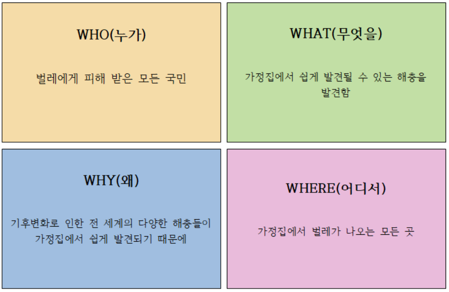
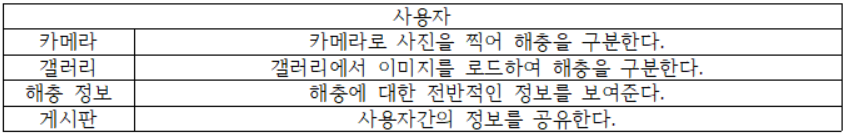
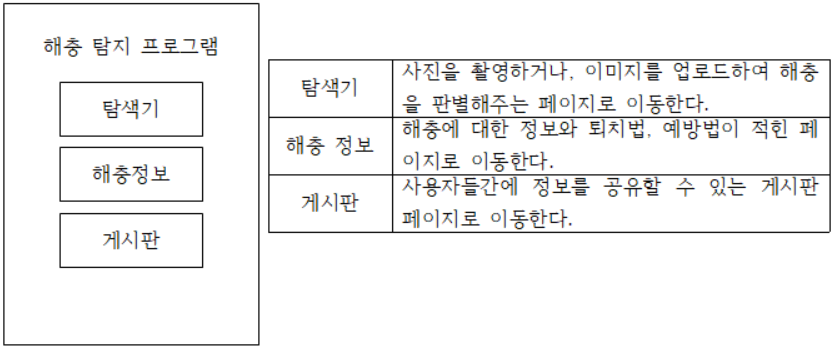
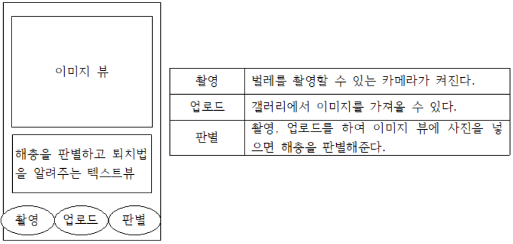
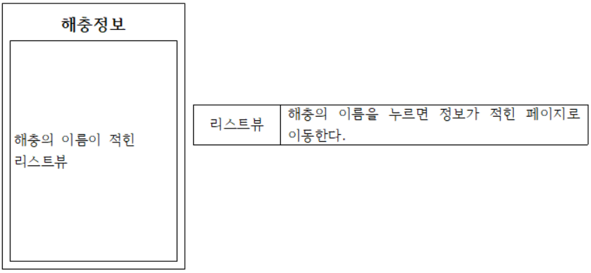
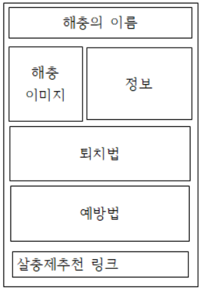
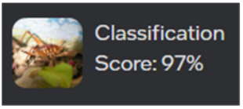

# Intel_Geti_Project

### 1. 기획서
#### A. 문제정의와 목적

#### B. 데이터 출처 및 사용
1) 실제 가정집에서 쉽게 발견될 수 있는 해충을 검색해 클래스를 구성하였음.
2) 곱등이, 빈대, 그리마, 쌀바구미, 나방파리, 집게벌레로 6개의 클래스로 구성.
3) 클래스 별 약 300장씩으로 네이버, 구글에서 크롤링하여 수집함.
4) Geti를 활용하여 데이터를 학습시켜 모델을 만듬

### 2. 앱 기능 명세서

#### A. 화면설계서
1)MainActivity : 카메라, 갤러리, 해충정보, 게시판으로 갈 수 있는 메뉴를 구성.

2)CameraActivity : 카메라로 사진을 찍어 해충을 구분한다.

3)InformationActivity : 해충의 이름이 적힌 리스트뷰로 구성

4)BugActivity : 해충의 정보와 퇴치법, 예방법, 살충제 추천을 해준다.

### 3. 개발보고서
#### A. 인공지능 모델 설계
1)사용모델 : Geti, Teachable Machine
-각 클래스 별로 약300장의 이미지를 Geti와 Teachable Machine에 각각 학습을 시킴.
-Geti에서 학습시킨 모델의 정확도가 97% 였으나, Tflite 파일로 변환하지 못하여 Teachable Machine을 사용하여 Tflite 모델을 추출해냄.

#### B. 학습데이터
1) 데이터수집 : 네이버와 구글에서 약300장씩 크롤링하여 이미지를 사용하였음.
2) 데이터특성 : 실제 해충들이 있을 만한 환경의 이미지가 많이 포함되어있어 정확도가 향상됨.

#### C. 모델평가
1) 모델학습 : Geti를 사용하여 모델을 학습시켰을 때 정확도가 97%가 나왔으나, Tflite모델로 변환하지 못하여 Teachable Machine을 사용하여 Tflite모델을 추출하였음.
2) 학습결과 및 테스트 : 학습결과 정확도가 97% 나옴.

#### D. 추후 개발 계획
1) 해충 탐지 어플리케이션에서 필요한 기능을 더 찾아 추가하여, 업데이트를 진행 할 것임
2) 사용자가 촬영, 업로드를 한 사진을 데이터로 재활용하여 더 정확도가 높은모델을 제작하여 업데이트 할 것임.
